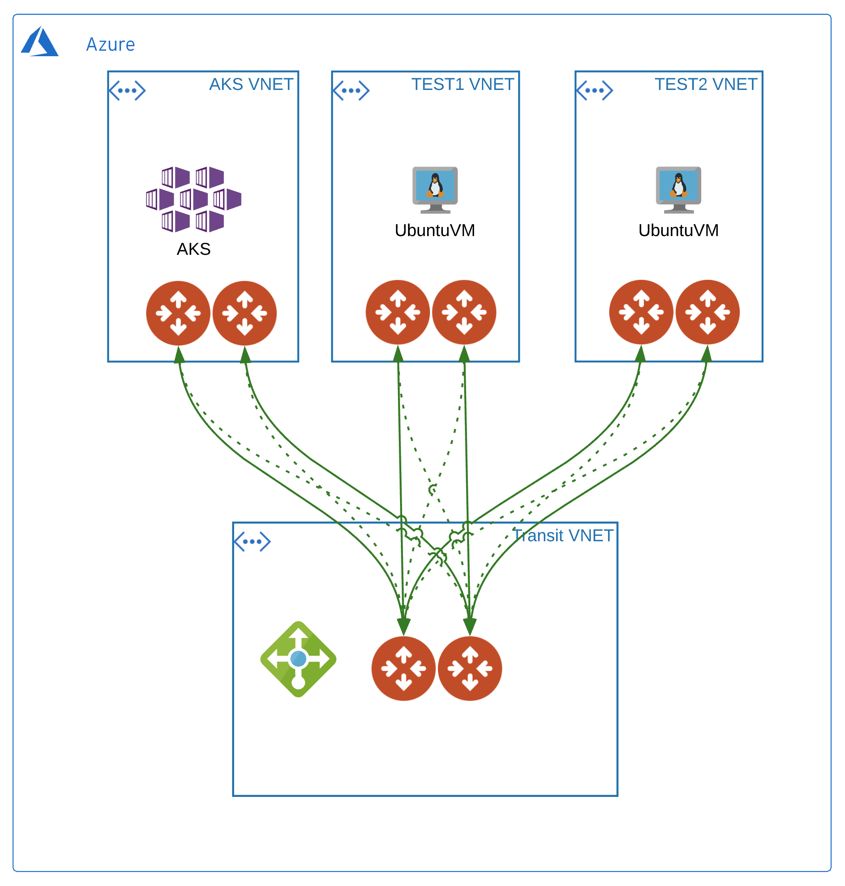
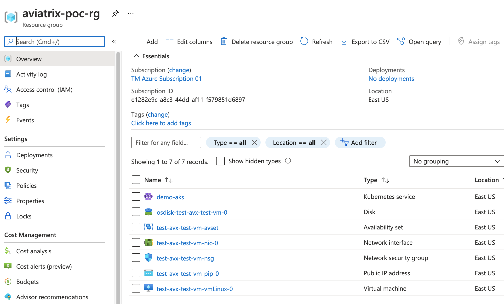

# Aviatrix Transit Azure (insane mode HPE) with AKS and Ubuntu Test VM

### Summary

This repo builds Aviatrix Transit in Azure **insane mode HPE**, spokes attached each with an ubuntu test vm. 
The test VM will use password authentication (randomly generated), have port 22 open and be provided public IPs. The test vm object(s) will be generated per spoke review output for public ip's.

### BOM

- 1 Aviatrix Transit in Azure with an 2 Aviatrix spokes defined in terraform.tfvars, i.e. ```azure_spokes = { "test1" = "10.23.0.0/20", "test2" = "10.24.0.0/20" }``` attached to Aviatrix Transit Gateway.
- 1 Azure Resource Group with Ubuntu 18.04 VM per spoke (iperf3 installed)
- 1 AKS Spoke
- 1 Azure Kubernetes Service with nginx helm chart

### Infrastructure diagram



### Azure Kubernetes 

Note the Cluster IP and External IPs for the nginx service.


### Azure Resource Group




### Compatibility
Terraform version | Controller version | Terraform provider version
:--- | :--- | :---
0.13 | 6.3 | 2.18.1

### Modules

Module Name | Version | Description
:--- | :--- | :---
[terraform-aviatrix-modules/azure-transit/aviatrix](https://registry.terraform.io/modules/terraform-aviatrix-modules/azure-transit/aviatrix/latest) | 3.0.0 | This module deploys a VNET, Aviatrix transit gateways.
[terraform-aviatrix-modules/azure-spoke/aviatrix](https://registry.terraform.io/modules/terraform-aviatrix-modules/azure-spoke/aviatrix/latest) | 3.0.0 | This module deploys a VNET and an Aviatrix spoke gateway in Azure and attaches it to an Aviatrix Transit Gateway
[Azure/compute/azurerm](https://registry.terraform.io/modules/Azure/compute/azurerm/0.9.0) | 0.9.0 | Azure Terraform module to deploy virtual machines

### Helm Charts
Chart | Version | Description
:--- | :--- | :---
[bitnami/nginx](https://artifacthub.io/packages/helm/bitnami/nginx) | 8.7.1 |  NGINX (pronounced "engine-x") is an open source reverse proxy server for HTTP, HTTPS, SMTP, POP3, and IMAP protocols, as well as a load balancer, HTTP cache, and a web server (origin server).

### Variables

The variables are defined in ```terraform.tfvars```.

**Note:** ```ha_enabled = false``` controls whether ha is built for spokes. 

```instance_size``` controls the size of all the transit spokes and gateways. 

```test_instance_size``` controls the size of the test vms.

### Prerequisites

- Software version requirements met
- Aviatrix Controller with Access Account in Azure
- Sufficient limits in place for Azure region in scope **_(Compute quotas, etc.)_**
- terraform .13 in the user environment ```terraform -v``` **_or use hashicorp/terraform docker image_** Instructions below.
- [Install the the azure cli](https://docs.microsoft.com/en-us/cli/azure/install-azure-cli-macos) on the workstation and authenticate with ```az login```

### Workflow

- Modify ```terraform.tfvars``` _(i.e. access account name, regions, cidrs, etc.)_ and save the file.
- ```terraform init```
- ```terraform plan```
- ```terraform apply --auto-approve```

### Test command examples

You can ssh into the the test vm's created in azure like so...

```ssh azureuser/test_vm_password@public_ip_address```

**test_vm_password,public_ip_address** will be in terraform output

#### iperf

Replace with the private IP of one of the created test vms - check terraform output for the value.
Run the client on one test vm and the server on another test vm.

```
iperf3 -s -p 5201 # on Spoke 1
iperf3 -c 10.24.1.4 -i 2 -t 30 -M 1400 -P 10 -p 5201 # on Spoke 2
```

- Instance size, location should be taken into account when making observations.
- Given the breadth of potential ```iperf3``` commands and configuration, you may experiment on your own.
- The sample results below were gathered in March 2021 in Azure.

#### Azure Location 
**_East US_**

#### Aviatrix Gateway size
**_Standard_D3_v2_**

#### Test VM Kit
**_Standard_DS3_v2_**


Size |	vCPU |	Memory: GiB	| Temp storage (SSD) GiB |	Max data disks	| Max cached and temp storage throughput: IOPS/MBps (cache size in GiB)	| Max uncached disk throughput: IOPS/MBps |	Max NICs	| Expected network bandwidth (Mbps)
:--- | :--- | :--- | :--- | :--- | :--- | :--- | :--- | :---   
Standard_DS3_v2 | 4 |	14	| 28 |	16 | 16000/128 (172) |	12800/192 | 	4 |	3000

[Azure Virtual Machine Sizing Documentation](https://docs.microsoft.com/en-us/azure/virtual-machines/dv2-dsv2-series)

```
iperf3 -s -p 5201 # on Spoke 1
iperf3 -c 10.24.1.4 -i 2 -t 30 -M 1400 -P 10 -p 5201 # on Spoke 2

- - - - - - - - - - - - - - - - - - - - - - - - -
[ ID] Interval           Transfer     Bandwidth       Retr
[  4]   0.00-30.00  sec  1.44 GBytes   412 Mbits/sec  624             sender
[  4]   0.00-30.00  sec  1.44 GBytes   412 Mbits/sec                  receiver
[  6]   0.00-30.00  sec   182 MBytes  50.8 Mbits/sec  338             sender
[  6]   0.00-30.00  sec   181 MBytes  50.6 Mbits/sec                  receiver
[  8]   0.00-30.00  sec   508 MBytes   142 Mbits/sec  398             sender
[  8]   0.00-30.00  sec   507 MBytes   142 Mbits/sec                  receiver
[ 10]   0.00-30.00  sec   750 MBytes   210 Mbits/sec  667             sender
[ 10]   0.00-30.00  sec   749 MBytes   209 Mbits/sec                  receiver
[ 12]   0.00-30.00  sec   216 MBytes  60.4 Mbits/sec  290             sender
[ 12]   0.00-30.00  sec   215 MBytes  60.2 Mbits/sec                  receiver
[ 14]   0.00-30.00  sec  1.04 GBytes   298 Mbits/sec  412             sender
[ 14]   0.00-30.00  sec  1.04 GBytes   298 Mbits/sec                  receiver
[ 16]   0.00-30.00  sec  2.63 GBytes   752 Mbits/sec  174             sender
[ 16]   0.00-30.00  sec  2.62 GBytes   751 Mbits/sec                  receiver
[ 18]   0.00-30.00  sec  1.02 GBytes   291 Mbits/sec  688             sender
[ 18]   0.00-30.00  sec  1.02 GBytes   291 Mbits/sec                  receiver
[ 20]   0.00-30.00  sec   239 MBytes  66.9 Mbits/sec  111             sender
[ 20]   0.00-30.00  sec   238 MBytes  66.5 Mbits/sec                  receiver
[ 22]   0.00-30.00  sec   273 MBytes  76.3 Mbits/sec  283             sender
[ 22]   0.00-30.00  sec   272 MBytes  76.1 Mbits/sec                  receiver
[SUM]   0.00-30.00  sec  8.24 GBytes  2.36 Gbits/sec  3985             sender
[SUM]   0.00-30.00  sec  8.23 GBytes  2.36 Gbits/sec                  receiver

iperf Done.
```


### kubernetes  

Depending on your requirements testing will nginx provides a basic mechanism to curl and get a result back. 

### Deploy with hashicorp docker image _optional_

#### 1) Pull the 13.6 image
```
docker pull hashicorp/terraform:0.13.6
```
#### 2) Init in $PWD with environment variables set
```
docker run -i -t -v $PWD:$PWD -w $PWD \
--env TF_VAR_username=$TF_VAR_username \
--env TF_VAR_password=$TF_VAR_password \
--env TF_VAR_controller_ip=$TF_VAR_controller_ip \
hashicorp/terraform:0.13.6 init
```

#### 3) Plan in $PWD with environment variables set
```
docker run -i -t -v $PWD:$PWD -w $PWD \
--env TF_VAR_username=$TF_VAR_username \
--env TF_VAR_password=$TF_VAR_password \
--env TF_VAR_controller_ip=$TF_VAR_controller_ip \
hashicorp/terraform:0.13.6 plan
```

#### 4) Apply in $PWD with environment variables set
```
docker run -i -t -v $PWD:$PWD -w $PWD \
--env TF_VAR_username=$TF_VAR_username \
--env TF_VAR_password=$TF_VAR_password \
--env TF_VAR_controller_ip=$TF_VAR_controller_ip \
hashicorp/terraform:0.13.6 apply --auto-approve
```


### Terraform state (post-provisioning)

```
$ terrafform state list
data.azurerm_subscription.current
data.azurerm_subscription.primary
data.template_file.azure-init
azurerm_kubernetes_cluster.aks
azurerm_resource_group.example
azurerm_role_assignment.aks
azurerm_subnet.vng_gateway_subnet
helm_release.nginx
local_file.local-config-file
random_password.password
module.azure_aks_spoke.aviatrix_spoke_gateway.default
module.azure_aks_spoke.aviatrix_spoke_transit_attachment.default[0]
module.azure_aks_spoke.aviatrix_vpc.default
module.azure_spoke["test1"].aviatrix_spoke_gateway.default
module.azure_spoke["test1"].aviatrix_spoke_transit_attachment.default[0]
module.azure_spoke["test1"].aviatrix_vpc.default
module.azure_spoke["test2"].aviatrix_spoke_gateway.default
module.azure_spoke["test2"].aviatrix_spoke_transit_attachment.default[0]
module.azure_spoke["test2"].aviatrix_vpc.default
module.azure_test_vm["test1"].data.azurerm_public_ip.vm[0]
module.azure_test_vm["test1"].data.azurerm_resource_group.vm
module.azure_test_vm["test1"].azurerm_availability_set.vm
module.azure_test_vm["test1"].azurerm_network_interface.vm[0]
module.azure_test_vm["test1"].azurerm_network_interface_security_group_association.test[0]
module.azure_test_vm["test1"].azurerm_network_security_group.vm
module.azure_test_vm["test1"].azurerm_network_security_rule.vm[0]
module.azure_test_vm["test1"].azurerm_public_ip.vm[0]
module.azure_test_vm["test1"].azurerm_virtual_machine.vm-linux[0]
module.azure_test_vm["test1"].random_id.vm-sa
module.azure_test_vm["test2"].data.azurerm_public_ip.vm[0]
module.azure_test_vm["test2"].data.azurerm_resource_group.vm
module.azure_test_vm["test2"].azurerm_availability_set.vm
module.azure_test_vm["test2"].azurerm_network_interface.vm[0]
module.azure_test_vm["test2"].azurerm_network_interface_security_group_association.test[0]
module.azure_test_vm["test2"].azurerm_network_security_group.vm
module.azure_test_vm["test2"].azurerm_network_security_rule.vm[0]
module.azure_test_vm["test2"].azurerm_public_ip.vm[0]
module.azure_test_vm["test2"].azurerm_virtual_machine.vm-linux[0]
module.azure_test_vm["test2"].random_id.vm-sa
module.azure_transit_1.aviatrix_transit_gateway.default
module.azure_transit_1.aviatrix_vpc.default

```
